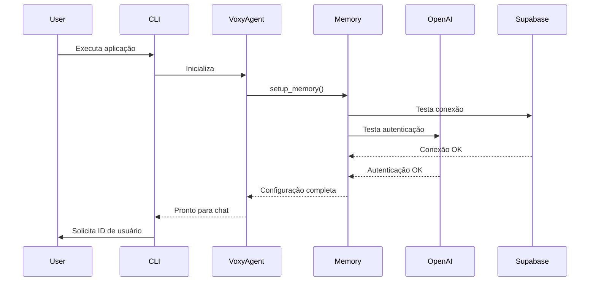
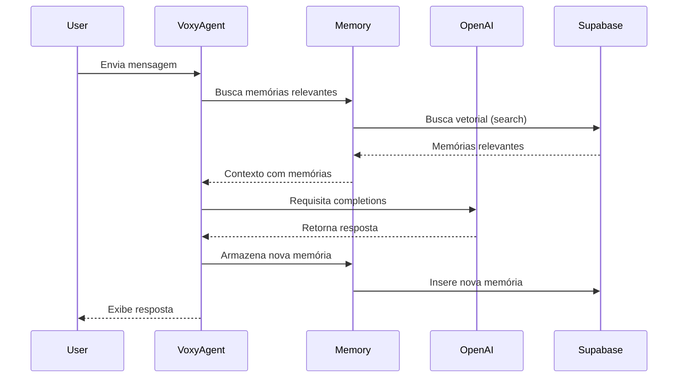

# README.AI.md - Voxy-Mem0 Arquitetura para LLMs

## 1. Visão Geral do Sistema

Voxy-Mem0 é um assistente conversacional baseado em IA com memória vetorial de longo prazo. A arquitetura utiliza um modelo cliente-servidor onde o cliente é a interface de linha de comando e o servidor consiste em:

1. Um modelo de linguagem grande (LLM) da OpenAI para processamento de linguagem natural
2. Um banco de dados Supabase com extensão pgvector para armazenamento vetorial
3. A biblioteca mem0 para gerenciamento de memória vetorial
4. Um sistema de logging para rastreamento e depuração

## 2. Arquitetura Técnica

```
┌──────────────────────────────────────────────────────────────────────┐
│                           INTERFACE DO USUÁRIO                        │
│                           (voxy_agent.py CLI)                         │
└───────────────────────────────────┬──────────────────────────────────┘
                                    │
                                    ▼
┌──────────────────────────────────────────────────────────────────────┐
│                           NÚCLEO DO SISTEMA                           │
│                                                                       │
│  ┌─────────────────┐      ┌─────────────────┐     ┌─────────────────┐ │
│  │                 │      │                 │     │                 │ │
│  │   Processador   │◄────►│  Gerenciador    │◄───►│   Camada de     │ │
│  │   de Mensagens  │      │  de Memória     │     │   Persistência  │ │
│  │                 │      │                 │     │                 │ │
│  └────────┬────────┘      └────────┬────────┘     └────────┬────────┘ │
│           │                        │                       │          │
│           ▼                        ▼                       ▼          │
│  ┌─────────────────┐      ┌─────────────────┐     ┌─────────────────┐ │
│  │                 │      │                 │     │                 │ │
│  │    OpenAI API   │      │  Biblioteca     │     │   Supabase DB   │ │
│  │    (LLM)        │      │  mem0           │     │   (pgvector)    │ │
│  │                 │      │                 │     │                 │ │
│  └─────────────────┘      └─────────────────┘     └─────────────────┘ │
│                                                                       │
└──────────────────────────────────────────────────────────────────────┘
```

## 3. Fluxo de Dados

O fluxo de dados principal segue este padrão:

1. **Entrada de Usuário** → O usuário fornece uma mensagem através da interface CLI
2. **Recuperação de Memória** → O sistema recupera memórias relevantes do banco de dados Supabase
3. **Processamento LLM** → A mensagem do usuário e as memórias recuperadas são enviadas para a API OpenAI
4. **Resposta LLM** → O modelo gera uma resposta baseada no contexto
5. **Armazenamento de Memória** → A conversa é armazenada como vetores no banco de dados
6. **Saída para o Usuário** → A resposta é exibida para o usuário

## 4. Componentes Principais

### 4.1 `voxy_agent.py`

O arquivo principal que coordena todo o fluxo da aplicação. Contém as funções:

- `setup_memory()`: Inicializa a conexão com OpenAI e a camada de memória
- `chat_with_memories()`: Processa mensagens do usuário, recupera memórias relevantes e gera respostas
- `main()`: Loop principal de execução da aplicação CLI

```python
# Exemplo simplificado da função principal
def chat_with_memories(message: str, user_id: str, openai_client, memory):
    # 1. Busca memórias relevantes
    relevant_memories = memory.search(query=message, user_id=user_id, limit=5)
    
    # 2. Prepara o contexto com memórias
    system_prompt = "Você é um assistente útil. Memórias do Usuário:\n" + memories_str
    
    # 3. Gera resposta via LLM
    response = openai_client.chat.completions.create(...)
    
    # 4. Armazena a nova memória
    memory.add(messages, user_id=user_id)
    
    return assistant_response
```

### 4.2 Módulo de Memória (via mem0)

A biblioteca mem0 gerencia a camada de memória com estas responsabilidades:

- Conversar mensagens em embeddings vetoriais
- Armazenar vetores no banco de dados Supabase
- Realizar busca semântica para recuperar memórias relevantes
- Segmentar memórias por usuário

```python
# Configuração da memória
config = {
    "llm": {
        "provider": "openai",
        "config": {"model": "gpt-4o-mini"}
    },
    "vector_store": {
        "provider": "supabase",
        "config": {
            "connection_string": DATABASE_URL,
            "collection_name": "voxy_memories"
        }
    }    
}
```

### 4.3 Camada de Persistência (Supabase)

O Supabase com a extensão pgvector atua como armazenamento para:

- Embeddings vetoriais das conversas
- Metadados de cada interação
- Segmentação por usuário para múltiplos usuários

A extensão `pgvector` permite busca por similaridade de cosseno para encontrar memórias semanticamente semelhantes.

### 4.4 Interface LLM (OpenAI)

O sistema utiliza a API OpenAI para:

- Gerar embeddings para as mensagens
- Processar mensagens do usuário com contexto de memórias
- Gerar respostas contextuais

## 5. Tabela de Dependências

| Componente | Versão | Propósito |
|------------|--------|-----------|
| mem0 | >=0.1.65 | Gerenciamento de memória vetorial |
| openai | >=1.33.0 | Interface com modelos LLM |
| python-dotenv | >=1.0.0 | Carregamento de variáveis de ambiente |
| pgvector | >=0.3.0 | Extensão para PostgreSQL suportar vetores |
| supabase | >=2.0.0 | Cliente para o banco de dados Supabase |
| psycopg2-binary | >=2.9.5 | Driver PostgreSQL para Python |

## 6. Cenários de Execução

### 6.1 Inicialização



### 6.2 Ciclo de Conversação



## 7. Padrões de Design

- **Injeção de Dependência**: Os componentes principais (OpenAI, Memory) são injetados nas funções.
- **Configuração via Ambiente**: Variáveis de ambiente são usadas para configuração externa.
- **Separação de Responsabilidades**: Cada componente tem responsabilidades bem definidas.
- **Façade**: A biblioteca mem0 atua como façade para operações complexas com vetores.

## 8. Considerações de Desempenho

- **Otimização de Consulta**: A função `search` limita as respostas a 5 memórias relevantes para otimizar o uso de tokens.
- **Lote de Interações**: O contexto inclui múltiplas interações para melhorar a coerência das respostas.
- **Conexão Persistente**: Conexões com Supabase e OpenAI são reutilizadas durante a sessão.

## 9. Extensibilidade

O sistema foi projetado com pontos de extensão:

- **Múltiplos Usuários**: Identificação por user_id permite escalabilidade multi-usuário.
- **Modelos Alternativos**: A configuração suporta outros modelos LLM.
- **Armazenamentos Alternativos**: A arquitetura permite substituir Supabase por outras soluções.

## 10. Glossário Técnico

- **Embedding**: Representação vetorial de texto que captura significado semântico.
- **Memória Vetorial**: Sistema que armazena informações como vetores e permite busca por similaridade.
- **pgvector**: Extensão PostgreSQL que adiciona suporte para vetores e busca por similaridade.
- **LLM**: Large Language Model, como GPT-4, usado para processamento e geração de texto.
- **Busca Semântica**: Recuperação de informações baseada em significado, não apenas palavras-chave.

## 11. Esquema de Banco de Dados

A tabela principal `vecs_voxy_memories` contém:

- `id`: Identificador único da memória
- `content`: O conteúdo da memória (mensagens)
- `metadata`: Informações adicionais incluindo o user_id
- `embedding`: Vetor de embeddings utilizado para busca semântica

## 12. Análise de Código

O núcleo da aplicação é a função `chat_with_memories` que orquestra:

```python
def chat_with_memories(message, user_id, openai_client, memory):
    # Buscar memórias relevantes
    relevant_memories = memory.search(...)
    
    # Preparar prompt com contexto de memórias
    system_prompt = "Você é um assistente..." + memories_str
    
    # Gerar resposta via OpenAI
    response = openai_client.chat.completions.create(...)
    
    # Armazenar nova memória
    memory.add(messages, user_id=user_id)
    
    return response
```

Este padrão implementa o conceito de "Retrieval-Augmented Generation" (RAG) onde o sistema:
1. Recupera informações relevantes
2. Aumenta o prompt com essas informações
3. Gera uma resposta contextual 